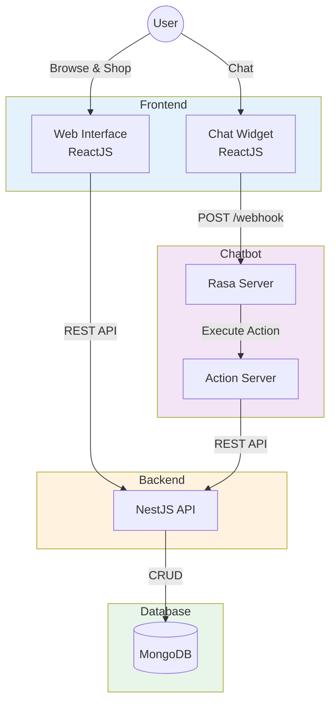
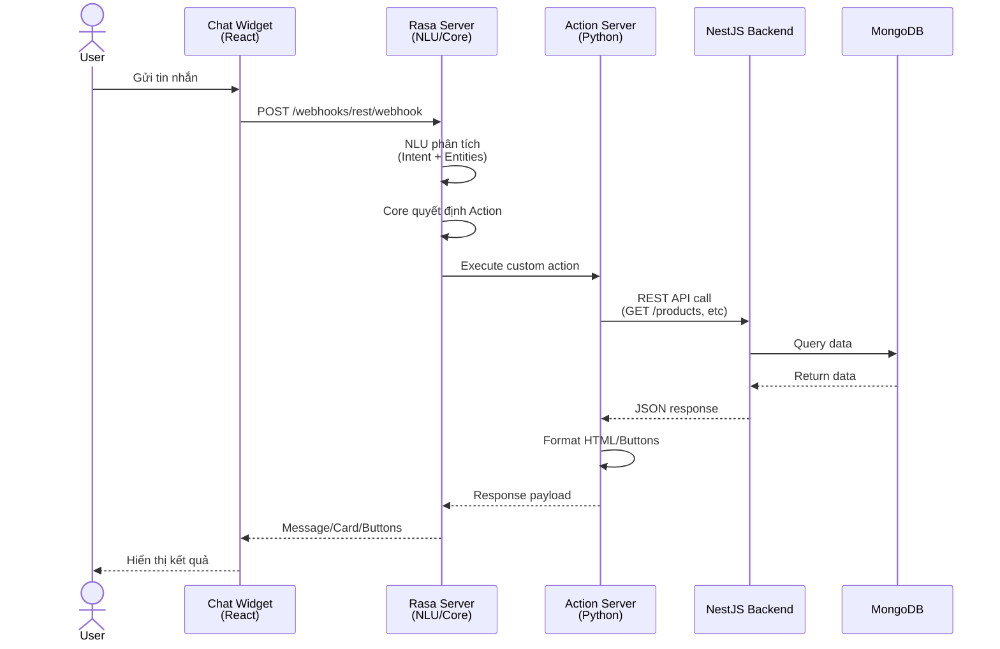
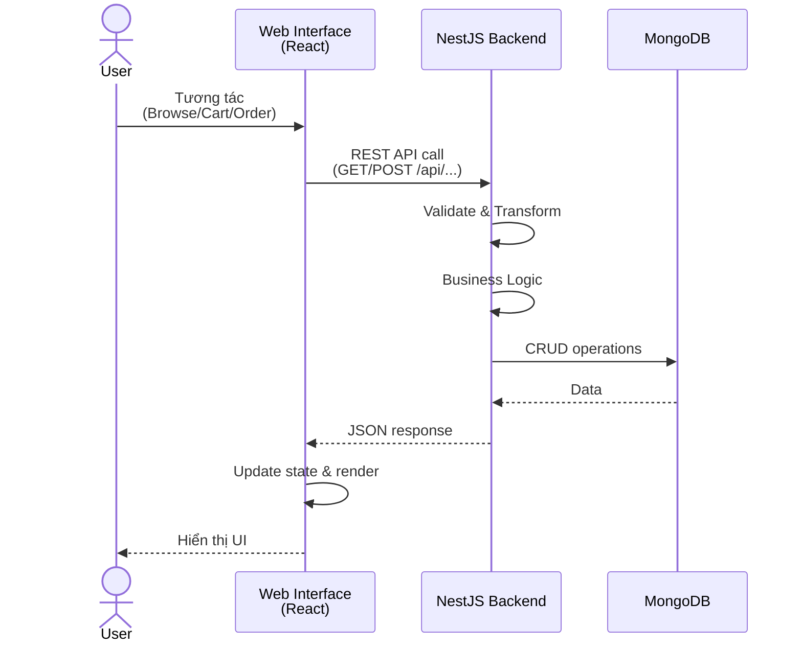

# Kiến Trúc Hệ Thống TechShop

## Tổng Quan

TechShop là hệ thống E-Commerce kết hợp AI Chatbot, được xây dựng trên kiến trúc phân tán với 3 thành phần chính:

- **Frontend (React)**: Giao diện người dùng và Chat Widget
- **Backend (NestJS)**: API Server và Business Logic
- **Chatbot (Rasa)**: AI Assistant hỗ trợ khách hàng 24/7

### Cấu Trúc Repo

| Module   | Repository                                                                   | Technology       |
| -------- | ---------------------------------------------------------------------------- | ---------------- |
| Frontend | [techshop](https://github.com/VoViet266/techshop_client_reactjs.git)         | React + Vite     |
| Backend  | [techshop-backend](https://github.com/VoViet266/techshop_backend-nestjs.git) | NestJS + MongoDB |
| Chatbot  | [techshop-chatbot](https://github.com/VoViet266/chatbot_rasa_techshop.git)   | Rasa 3.x         |

**Lợi ích:**

- Deployment và versioning độc lập
- Team làm việc song song, không conflict
- CI/CD riêng biệt cho từng service
- Dễ scale và maintain

---

## Frontend (ReactJS)

### Tech Stack

- **Framework**: React 18+ với Vite
- **State Management**: React Query, Context API
- **Routing**: React Router v6
- **Styling**: CSS Modules / Tailwind CSS

### Chức Năng Chính

**Web Interface:**

- Browse sản phẩm với filters và search
- Quản lý giỏ hàng và checkout
- Theo dõi đơn hàng
- Quản lý tài khoản
- Admin quản lý

**Chat Widget:**

- Giao diện chat tích hợp Rasa
- Render HTML cards, buttons từ Chatbot
- Real-time messaging (REST/WebSocket)

---

## Backend (NestJS)

### Tech Stack

- **Framework**: NestJS (Node.js + TypeScript)
- **Database**: MongoDB với Mongoose ORM
- **Authentication**: JWT + Passport
- **Validation**: class-validator

### Module Structure

```
src/
├── auth/           # Xác thực & Phân quyền
├── user/           # Quản lý người dùng
├── product/        # Sản phẩm
├── variant/        # Biến thể sản phẩm (màu sắc, dung lượng)
├── category/       # Danh mục
├── brand/          # Thương hiệu
├── order/          # Đơn hàng
├── cart/           # Giỏ hàng
└── branch/         # Chi nhánh cửa hàng
```

### Core APIs

- **Auth**: Login, Register, JWT Refresh
- **Products**: CRUD, Search, Filter
- **Categories & Brands**: Browse hierarchy
- **Cart**: Add, Update, Remove items
- **Orders**: Create, Track, History

### Key Features

**Dynamic Schema (Category)**

- Mỗi `Category` có `configFields` định nghĩa các thuộc tính động
- Cho phép so sánh sản phẩm theo tiêu chí khác nhau (Laptop: RAM, CPU | Phone: Camera, Battery...)

**Variant Management**

- Mỗi sản phẩm có nhiều variants (màu sắc, dung lượng)
- Giá và hình ảnh quản lý theo variant

---

## Rasa Chatbot

### Tech Stack

- **NLU Engine**: Rasa NLU (Intent + Entity Extraction)
- **Dialogue**: Rasa Core (Stories + Rules)
- **Action Server**: Python 3.10 + Custom Actions
- **Model**: Transformer-based embeddings

### Chức Năng AI Assistant

**Intent chính được hỗ trợ:**

- Hỏi thông tin sản phẩm (`ask_product_info`)
- Hỏi giá (`ask_product_price`)
- So sánh sản phẩm (`compare_products`)
- Kiểm tra tồn kho (`check_stock`)
- Quản lý giỏ hàng (`add_to_cart`, `view_cart`)
- Tra cứu đơn hàng (`ask_order`)
- Thông tin cửa hàng (`ask_store`)
- Mua hàng (`order_product`)
- Nói chuyện phím (`chitchat`)

### Custom Actions

```python
# Các action quan trọng
action_provide_product_info   # Hiển thị thông tin sản phẩm
action_compare_products       # So sánh 2 sản phẩm
action_check_stock           # Kiểm tra tồn kho
action_add_to_cart           # Thêm vào giỏ hàng
action_check_order           # Tra cứu đơn hàng
action_provide_store_info    # Thông tin chi nhánh
```

**Đặc điểm nổi bật:**

- Action Server gọi NestJS Backend API (không truy cập trực tiếp DB)
- Response dạng HTML card với inline CSS
- Deep linking sang Web App để hoàn tất giao dịch

---

## Sơ Đồ Kiến Trúc

### Tổng Thể Hệ Thống



### Luồng Chatbot



### Luồng Web App



---

## Điểm Nổi Bật

### 1. Centralized Business Logic

- **Tất cả logic nghiệp vụ** tập trung tại NestJS Backend
- Rasa Action Server chỉ gọi API, không xử lý logic phức tạp
- Đảm bảo tính nhất quán giữa Web App và Chatbot

### 2. Dynamic Product Comparison

- Schema `Category` có `configFields` định nghĩa trường so sánh động
- Chatbot tự động render bảng so sánh theo config của từng danh mục
- Không cần hardcode logic cho từng loại sản phẩm

### 3. Seamless Integration

- User có thể đặt hàng qua Web hoặc Chatbot
- Tra cứu đơn hàng trên cả 2 kênh
- Deep linking từ Chatbot sang Web App

### 4. Scalable Architecture

- Multi-repo cho phép scale từng module độc lập
- Chatbot có thể deploy riêng không ảnh hưởng Web
- Backend API có thể phục vụ multiple clients (Mobile app, Admin panel...)

---

## Tech Stack Summary

| Component     | Technology       | Purpose                          |
| ------------- | ---------------- | -------------------------------- |
| Frontend      | React + Vite     | Web UI & Chat Widget             |
| Backend API   | NestJS + MongoDB | Business Logic & Data Management |
| Rasa Server   | Rasa 3.x         | NLU & Dialogue Management        |
| Action Server | Python 3.10      | Custom Actions & API Calls       |
| Database      | MongoDB          | NoSQL Data Storage               |

---

## Repository Links

- **Frontend**: [techshop_client_reactjs](https://github.com/VoViet266/techshop_client_reactjs.git)
- **Backend**: [techshop_backend-nestjs](https://github.com/VoViet266/techshop_backend-nestjs.git)
- **Chatbot**: [chatbot_rasa_techshop](https://github.com/VoViet266/chatbot_rasa_techshop.git)
